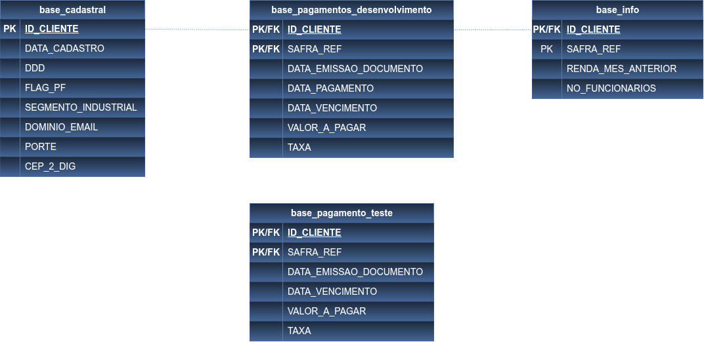
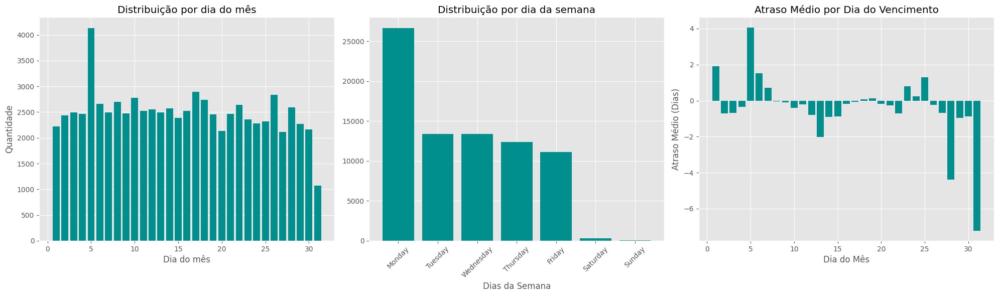
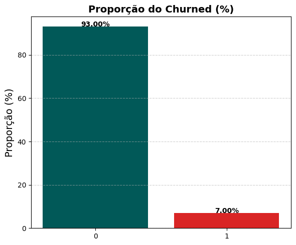
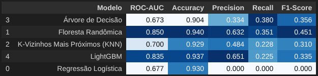

 

# Modelo Preditivo para Inadimplência
## Introdução
Este projeto simula um cenário de inteligência de crédito, no qual uma empresa de consultoria especializada em soluções de dados auxilia instituições financeiras na identificação antecipada de clientes com maior risco de inadimplência.

O cenário envolve o acompanhamento mensal do comportamento financeiro dos clientes, considerando informações cadastrais, características econômicas e o histórico de pagamentos de suas cobranças.

A partir desses dados, busca-se desenvolver uma solução de Machine Learning capaz de estimar a probabilidade de uma cobrança não ser paga dentro do prazo esperado.

## Objetivo Principal
Em operações de crédito e cobrança, identificar clientes com maior risco de atraso antes do vencimento ou do agravamento da situação permite que a empresa adote estratégias proativas, como priorização de contatos e ações de cobrança direcionadas.

Desenvolver um **modelo preditivo** capaz de estimar a probabilidade de inadimplência de cobranças mensais feitas aos clientes. Neste projeto a **inadimplência** é definida da seguinte forma:

> [!IMPORTANT]
> 
> Neste projeto, um pagamento é considerado inadimplente se for realizado com **5 dias ou mais de atraso** em relação à data de vencimento. As previsões devem conter apenas a probabilidade de inadimplência (valores entre 0 e 1).
>
> O resultado final será um arquivo `.csv` chamado `resultado_final.csv`, contendo exatamente as seguintes colunas:
> - `ID_CLIENTE`
> - `SAFRA_REF`
> - `PROBABILIDADE_INADIMPLENCIA`

## Detalhes dos Dataset
Existem *quatro bases de dados* na pasta `data-raw` com informações sobre os clientes, o comportamento mensal e os registros de pagamentos. Essas bases foram extraídas de um sistema de cobrança e representam um cenário realista de operação. As tabelas se relacionam principalmente por duas chaves:
- **ID_CLIENTE**: identifica cada cliente de forma única
- **SAFRA_REF**: representa o período de referência da cobrança 

A estrutura  de cada base é a seguinte:
- `base_cadastral.csv`: reúne informações cadastrais dos clientes, como data de cadastro, porte da empresa, CEP e domínio do e-mail. Cada linha representa um cliente único (ID_CLIENTE).
- `base_info.csv`: traz dados mensais relacionados ao cliente, como renda do mês anterior e número de funcionários. Cada linha representa um cliente em um determinado mês (ID_CLIENTE, SAFRA_REF).
- `base_pagamentos_desenvolvimento.csv`: cobranças e pagamentos já realizados. Cada linha representa uma cobrança mensal para um cliente (ID_CLIENTE, SAFRA_REF), com as datas de vencimento e pagamento disponíveis para construção da variável target.
- `base_pagamentos_teste.csv`: contém as cobranças mais recentes, para as quais o modelo deve prever a probabilidade de inadimplência. Cada linha representa uma cobrança mensal, sem a informação de pagamento.

## Estrutura do Projeto
A estratégia utilizada neste projeto foi dividir em **dois arquivos .ipynb**, cada um abordando uma etapa:

- Análise exploratória dos dados;
- Tratamento e preparação das bases;
- Integração das diferentes fontes de dados;
- Engenharia de atributos;
- Construção da variável-alvo;
- Treinamento de modelos de classificação;
- Validação e comparação dos modelos;
- Avaliação das métricas de desempenho;
- Geração de probabilidades de inadimplência para novas cobranças.

1. **PARTE I**: Manipulação do dataset com o objetivo de tratar valores ausentes para viabilizar a análise exploratória dos dados e observação de insigths pela variável Churned. O processo foi conduzido da seguinte forma:
- Identificação e contabilização dos dados ausentes;
- Definição de estratégias para imputação dos valores faltantes, incluindo:
    - Uso da mediana;
    - Uso da média;
- Realização da análise exploratória com o objetivo de compreender o comportamento das variáveis e extrair insights relevantes, os processos incluíram:
    - Construção de gráficos e visualizações para facilitar a interpretação dos dados;
    - Identificação de padrões, tendências e relações entre as variáveis;
    - Análise da variável target.

> O código-fonte está disponível em: [link](https://github.com/rrafahenrique/Modelo-Preditivo-Inadimplencia/blob/main/notebooks/01-data_cleaning-eda.ipynb)

2. **PARTE II**: Desenvolvimento e avaliação dos modelos de Machine Learning com foco na previsão da inadimplência. Nesta etapa foram realizadas: 
- Engenharia de features a partir de variáveis temporais, com o tratamento e a extração de informações relevantes das colunas de data.  
- Foram utilizados e comparados os seguintes algoritmos:
    - Regressão Logística;
    - Random Forest;
    - Árvore de Decisão;
    - K-Nearest Neighbors (KNN);
    - LightGBM.

> O código-fonte está disponível em: [PARTE II.ipynb](https://github.com/rrafahenrique/Modelo-Preditivo-Inadimplencia/blob/main/PARTE%20II.ipynb) 

## Resultados
O ínicio dete estudo de caso se deu tratando os valores ausentes do dataset, sendo identificado que algumas features apresentavam dados faltantes.

Para lidar com essas inconsistências, foram aplicadas diferentes **estratégias de imputação**, como o uso de média, mediana e técnicas baseadas em groupby com outras variáveis, buscando preservar ao máximo a coerência dos dados.

Após o tratamento, foi realizada uma **análise exploratória**, com foco na distribuição, quantidade e proporção das variáveis, utilizando visualizações gráficas para facilitar a interpretação.

Além disso, foi conduzida uma **análise detalhada da variável target**, com o objetivo de identificar padrões e tendências relevantes, contribuindo para a geração de insights e suporte às etapas seguintes do projeto.

Para facilitar o fluxo de trabalho na pasta `docs`  foram são dataset já limpos sem dados faltantes para serem utilizados na `PARTE II.ipynb`.

A próxima etapa consistiu em preparar o **dataset de treino e teste** para a modelagem com algoritmos de Machine Learning. Foram criadas features temporais e o tratamento do **desbalanceamento da variável target**, utilizando técnicas de **Oversampling**  e **Undersampling**.

No final foram obtidos e comparados os resultados de cada algoritmo de Machine Learning. 

Após aplicar a técnica de Undersampling, observou-se que os modelos de **Árvore de Decisão** e **Floresta Randômica** apresentaram os melhores desempenhos. No entanto, a Floresta Randômica demonstrou maior estabilidade e equilíbrio entre as métricas, destacando-se por uma **Accuracy** elevada, além de **Precision, F1-Score** e **ROC-AUC** superiores em comparação à Árvore de Decisão.

